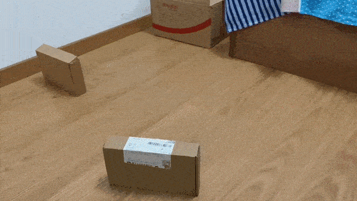
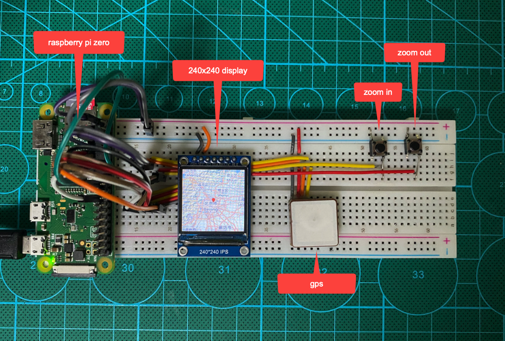

### Hi there, I'm Shanghui Yang from [Beijing](https://en.wikipedia.org/wiki/Beijing), China.

I'm working as a senior backend software engineer(golang) and map engineer(navigation).

### Projects
#### [theSmartCar](https://github.com/shanghuiyang/rpi-projects/tree/main/projects/car)

#### [GPSTracker](https://github.com/shanghuiyang/rpi-projects/tree/main/projects/gpstracker)

